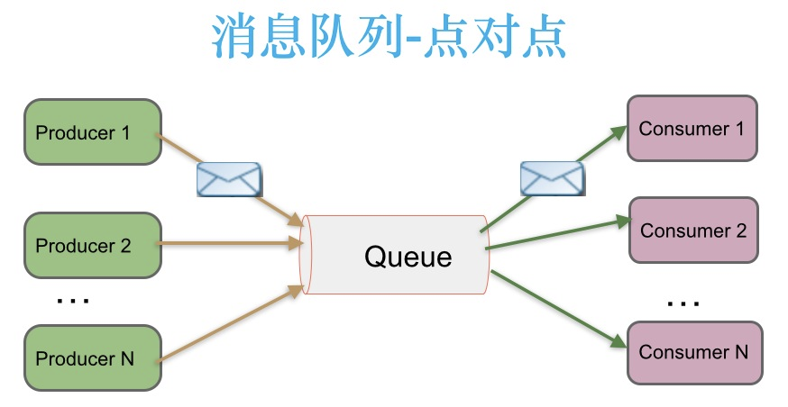
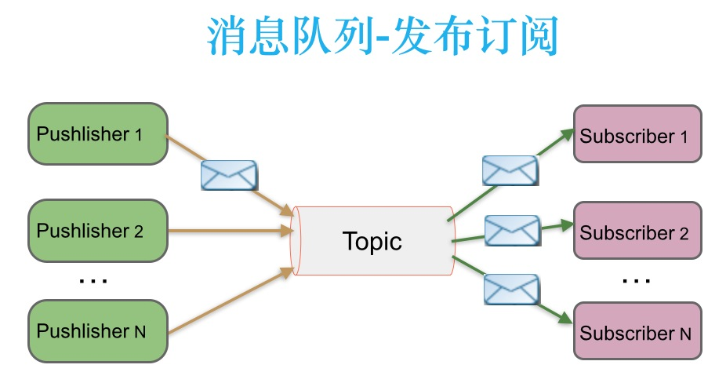
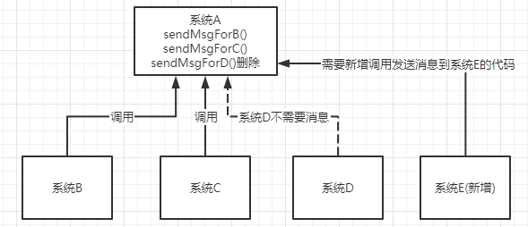
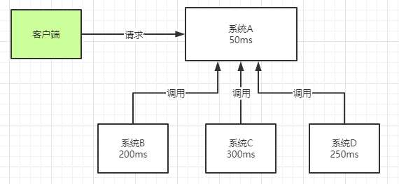
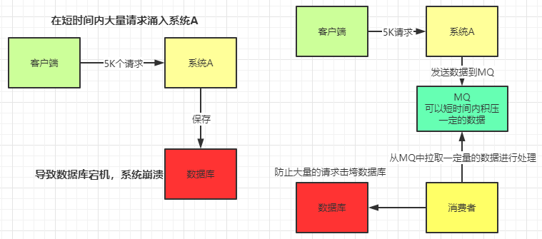
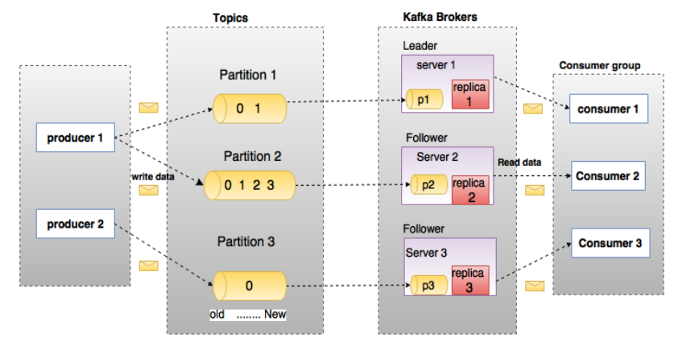
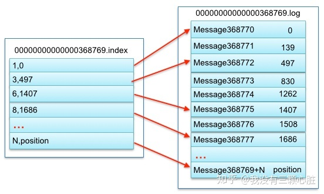

# Kafka

## 为什么需要消息系统

一个消息系统负责将数据从一个应用传递到另外一个应用，应用只需要关注数据，而不再需要关注数据在两个或多个应用间是怎么传递的。分布式消息传递基于可靠的消息队列，在客户端应用和消息系统之间异步传递消息。

举个现实生活中的例子：当你网购了一件商品，由于你在上班，快递小哥突然给你打电话告诉你快递到了，然而你也走不开。这个时候就两个人就僵持住了，最后快递小哥告诉你可以给你放到快递站等你有空了再来拿。

这个例子中的你就扮演了Kafka概念中的producer（生产者）而快递小哥扮演了Kafka概念中的Consumer（消费者）快递站则是Kafka(消息中间件)。

## Kafka简介

* 以时间复杂度O（1）的方式提供消息持久化能力，即使对于TB级以上数据也能保证常熟时间的访问性能。
* 高吞吐量，即使在非常廉价的商用机械上也能做到单机支持每秒100K条消息的传输。
* 支持Kafka Server间的消息分区，及分布式消费，同时保证每个[partition]()内的消息顺序传输。
* 同时支持离线数据处理和实时数据处理。
* Scale out：支持在线水平扩展。

## Kafka两种主要的消息传递方式

1. **点对点消息传递模式**

在点对点消息系统中，消息持久化到一个队列中。此时，将有一个或多个消费者，消费消息队列中的数据。但一条消息只能被消费一次。当一个消费者消费了队列中的某条数据之后，该条数据从消息队列中删除。该模式即使有多个消费者同时消费数据，也能保证数据处理的顺序。



生产者发送一条消息到queue，只有一个消费者能收到。

2. **发布-订阅消息传递模式**

在发布-订阅消息系统中，消息被持久化到一个Topic中。与点对点消息系统不同的是消费者可以订阅一个或多个Topic，消费者可以消费该Topic中所有的数据，同一条数据可以被多个消费者消费，数据被消费后不会立马被删除。在发布-订阅系统中，消息的生产者称为发布者（Pushlisher），消费者称为订阅者（Subscriber）。



发布者发送到Topic的消息，只有订阅了Topic的订阅者才会收到消息。

## Kafka的优点

1. **解耦**
如图所示。假设有系统B、C、D都需要系统A的数据，于是系统A调用三个方法发送数据到B、C、D。这时，系统D不需要数据了，那就需要在系统A把相关的代码删掉。假设这时有个新的系统E需要数据，这是系统A又要增加调用系统E的代码。为了降低这种强耦合，就可以用消息中间件，系统A只需要把数据发送到消息中间件，其它系统如果需要数据，则从数据中间件获取即可。



2. **异步**

如图所示。一个客户端请求发送过来，系统A会调用系统B、C、D三个系统，同步请求的话，响应时间就是系统A、B、C、D的总和，也就是800ms。如果使用消息中间件，系统A发送数据到消息中间件，然后就可以返回响应给客户端，不需要在等待B、C、D的响应，可以大大地提高性能。对于一些非必要的业务，比如发短信，发邮件等等，就可以采用消息中间件。



3. **削峰与缓存**

如图所示。这也是消息中间件一个很重要的功能，假设系统A在某一段时间请求数暴增，有5000个请求发送过来，系统A这时就会发送5000条SQL进入Mysql进行执行，Mysql对于如此庞大的请求当然处理不过来，Mysql就会崩溃，导致系统瘫痪。如果使用消息中间件，系统A不再是直接发送SQL语句到数据库，而是把数据发送到消息中间件，消息中间件短时间积压数据是可以接受的，然后由消费者每次拉去2000条进行处理，防止在请求峰值时期大量的请求直接发送到Mysql导致系统崩溃。



4. **可恢复性**

系统的一部分组件失效时，不会影响到整个系统。消息队列降低了进程间的耦合度，所以即使一个处理消息的进程挂掉，加入队列中的消息仍然可以在系统恢复后被处理。

## Kafka基础概念

在进行对Kafka深入理解之前先介绍一下Kafka中的术语。下图展示了Kafka的相关术语以及之间的关系:



上图中一个Topic配置了3个partition。partition1有两个offset：0和1。partition2有四个offset。partition3有一个offset。副本的id和副本所在的机械的id恰好相同。

如果一个Topic的副本数为3，那么Kafka将在集群中为每个partition创建三个相同的副本。集群中的每个broker储存一个或多个partition。多个producer（生产者）和consumer（消费者）可同时生产和消费数据。

## 相关术语解释

### 1. Producer

生产者及数据的发布者，该角色将消息发布到Kafka的[Topic]()中。[Broker]()接收到生产者发送的消息后，Broker将该消息追加到当前用于追加数据的[Segment]()文件中。生产者发送的消息，储存到一个[Partition]()中，生产者也可以指定数据存储的Partition。

### 2. Consumer

消费者可以从Broker中读取数据，消费者可以消费多个Topic中的数据。

### 3. Consumer Group

每个Consumer属于一个特点的Consumer Group（可为每个Consumer指定group name，若不指定group name则属于默认的group）。

### 4. Topic

每条发布到Kafka集群的消息都有一个类别，这个类别被称为Topic。（物理上不同Topic的消息分开存储，逻辑上一个Topic的消息虽然保存于一个或多个Broker上但用户只需要指定消息的Topic既可生产或消费数据而不必关心数据存于何处）类似于数据库的表名。

一个Topic可以认为是一类消息，每个Topic将被分成多个Partition（区），每个Partition在存储层是append log文件。任何发布到此Partition的消息都会被直接追加到log文件的尾部，每条消息在文件中的位置称为offset（偏移量），offset为一个long型数字，它唯一的标记一条消息。Kafka并没有提供其它额外的索引机制来存储offset，因为在Kafka中几乎不允许对消息进行”随机读写“。

对于Consumer而言，它需要保持消费消息的offset，对于offset的保存和使用，由Consumer来控制。当consumer正常消费消息时，offset将会”线性“的向前驱动，即消息将依次顺序被消费。事实上Consumer可以使用任意顺序消费消息，它只需要将offset重置为任意值。（offset将会保存在zookeeper中）。

### 5. Partition

Topic中的数据分割为一个或多个Partition。每个Topic至少有一个Partition。每个Partition中的数据使用多个Segment文件存储。Partition中的数据是有序的，不同Partition间的数据丢失了数据的顺序。如果Topic有多个Partition，消费数据时就不能保证数据的顺序。在需要严格保证消息的消费顺序的场景下，需要将Partition数目设为1。

### 6. Segment

Partition物理上由多个segment组成，每个Segment存着message信息。

### 7. Broker

Kafka集群包含一个或多个服务器，服务器节点称为Broker。

Broker存储Topic的数据。如果某Topic有N个Partition，集群有N个Broker，那么每个Broker存储该Topic的一个Partition。

如果某个Topic有N个Partition，集群有（N+M）个Broker，那么其中有N个Broker存储该Topic的一个Partition，剩下的M个Broker不存储该Topic的Partition数据。

如果某个Topic有N个Partition，集群中Broker数目少于N个，那么一个Broke存储该Topic的一个或多个Partition。在实际生产环境中，尽量避免这种情况的发生，这种情况容易导致Kafka集群数据不均衡。

### 8. Leader

每个Partition由多个副本，其中有且仅有一个作为Leader，Leader是当前负责数据的读写的Partition。

### 9. Follower

Follower跟随Leader，所有写请求都通过Leader路由，数据变更会广播给所有Follower，Follower与Leader保持数据同步。如果Leader失效，则从Follower中选举出一个新的Leader。当Follower与Leader挂掉、卡住或者同步太慢，Leader会把这个Follower从“in sync replicas”(ISR)列表中删除，重新创建一个Follower。

## 深入了解Kafka

1. Kafka的消息是存储在文件系统之上的。

Kafka高度依赖文件系统来存储和缓存消息，一般的人认为”磁盘是缓慢的“，所以对这样的设计持怀疑态度。实际上，磁盘比人们预想的块很多也慢很多，这取决于它们如何被使用；一个好的磁盘结构设计可以使速度与网络一样块。

现代的操作系统针对磁盘的读写已经做了一些优化方案来加快磁盘的访问速度。比如，**预读**会提前将一个比较大的磁盘快读入内存。**后写**会将很多小的逻辑写操作合并起来组合成一个大的物理写操作。并且，操作系统还会将主内存剩余的所有空闲内存空间都用作磁盘的缓存，所有的磁盘读写操作都会经过统一的磁盘缓存（除了直接I/O会绕过磁盘缓存）。综合这几点优化特点，如果是针对磁盘的顺序访问，某些情况下它可能比随机的内存访问都要快，甚至可以和网络的速度相差无几。

上文相关术语解释中的[Topic]()其实是逻辑上的概念，面向消费者和生产者，物理上存储的其实是[Partition]()，每一个Partition最终对应一个文件目录，里面存储所有的消息和索引文件。默认情况下，每一个Topic在创建时如果不指定Partition数量时只会创建1个Partition。比如，我创建了一个Topic名字为test，没有指定Partition的数量，那么会默认创建一个`test-0`的文件目录，这里的命名规则是：

`<Topic_name>-<Topic_id>`

任何发布到Partition的消息都会被追加到Partition数据文件的尾部，这样的顺序写磁盘操作让Kafka的效率非常高。

2. Kafka中的底层存储设计

假设我们现在Kafka集群只有一个Broker，我们创建2个Topic名称分别为（Topic1）和（Topic2），Partition数量分别在Topic1中为1、Topic2中为2，那么我们的根目录下就会创建三个文件夹：

```
├─ topic1-0
├─ topic2-0
├─ topic2-1
```

在Kafka的文件存储中，同一个Topic下有多个不同的Partition，每个Partition都是一个文件目录，而每个文件目录又被平均分配成多个大小相等的[Segment File]()，Segment File 又由index file和data file 组成，它们总是成对出现，后缀名分别是”.index“、”.log“分别表示Segment索引文件和数据文件。

现在假设我们设置每个Segment大小为500MB，并启动生产者向Topic1中写入大量数据，topic-0文件目录中就会产生类似如下的一些文件：

```
├─ topic1-0
|  └─ 00000000000000000000.index
|  └─ 00000000000000000000.log
|  └─ 00000000000000368769.index
|  └─ 00000000000000368769.log
|  └─ 00000000000000737337.index
|  └─ 00000000000000737337.log
|  └─ 00000000000001105814.index
|  └─ 00000000000001105814.log
├─ topic2-0
├─ topic2-1
```

Segment是Kafka文件存储的最小单位。Segment文件命名规则：Partition全局的第一个Segment从0开始，后续每个Segment文件为上一个Segment文件最后一条消息的offset值。数值最大为64位long大小，19位数字字符长度，没有数字用0填充。

说明一下索引文件和数据文件对应关系：



其中以索引文件元数据[3,497]为例，依次在数据文件中表示第3个message（在全局Partition表示第 368769 + 3 = 368772个message）以及该消息物理偏移地址为497。

注意该index文件并不是从0开始，也不是每次递增1的，这是因为Kafka采取稀疏索引存储的方式，每隔一定字节的数据建立一条索引，它减少了索引文件大小，使得能把index映射到内存，降低了查询时的磁盘IO开销，同时也并没有给查询带来太多的时间消耗。

因为其文件名为上一个Segment最后一条消息的offset，所以当需要查找一个指定offset的message时，通过在所有Segment的文件名中进行二分查找就能找到它归属的Segment，再在其index文件中找到其对应到文件上的物理位置就能拿到对应message。

由于消息再Partition的Segment数据文件中时顺序读写的，且消息消费后不会删除（删除策略时针对过期的Segment文件）。

Kafka定义了标准的数据存储结构，再Partition中的每一条message都包含了以下三个属性

* offset：表示 message 在当前 Partition 中的偏移量，是一个逻辑上的值，唯一确定了 Partition 中的一条 message，可以简单的认为是一个 id；
* MessageSize：表示 message 内容 data 的大小；
* data：message 的具体内容