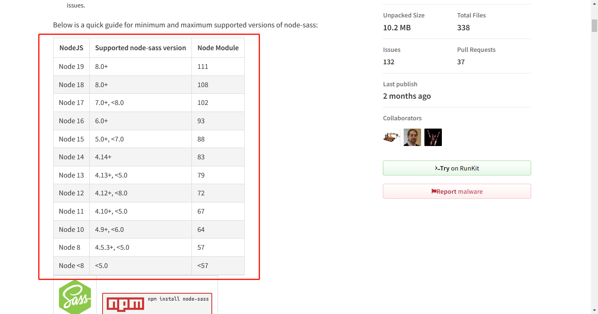
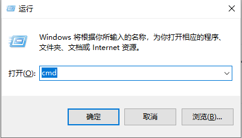
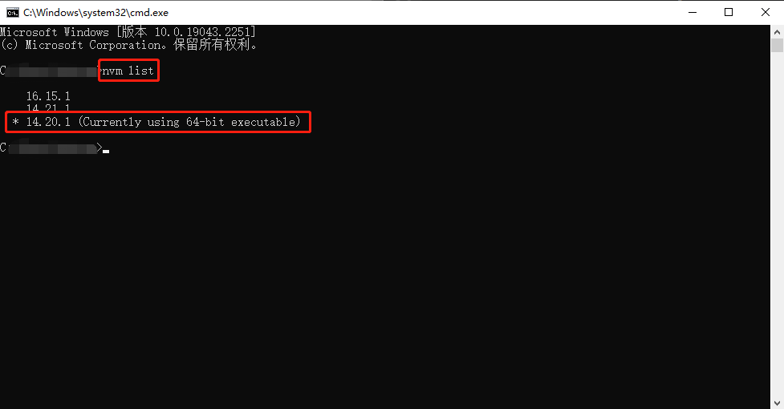
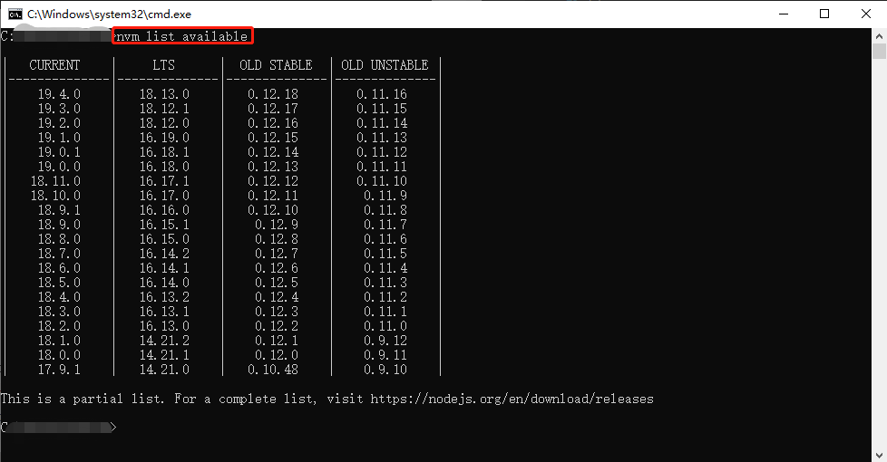
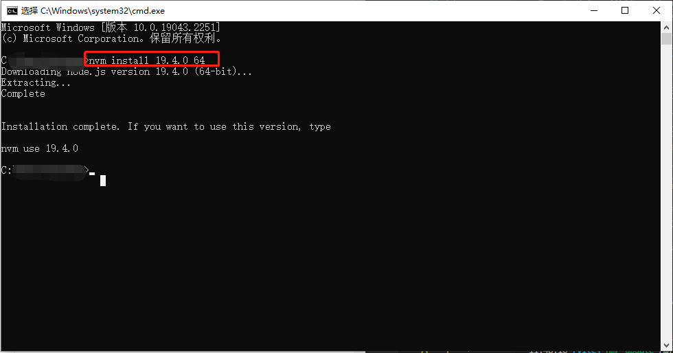
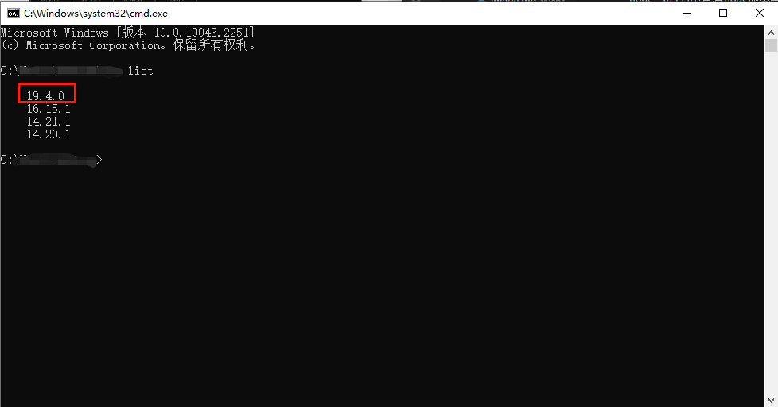
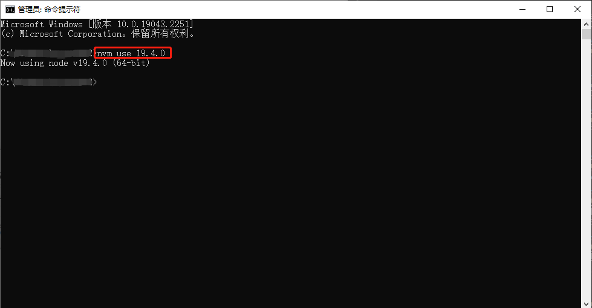
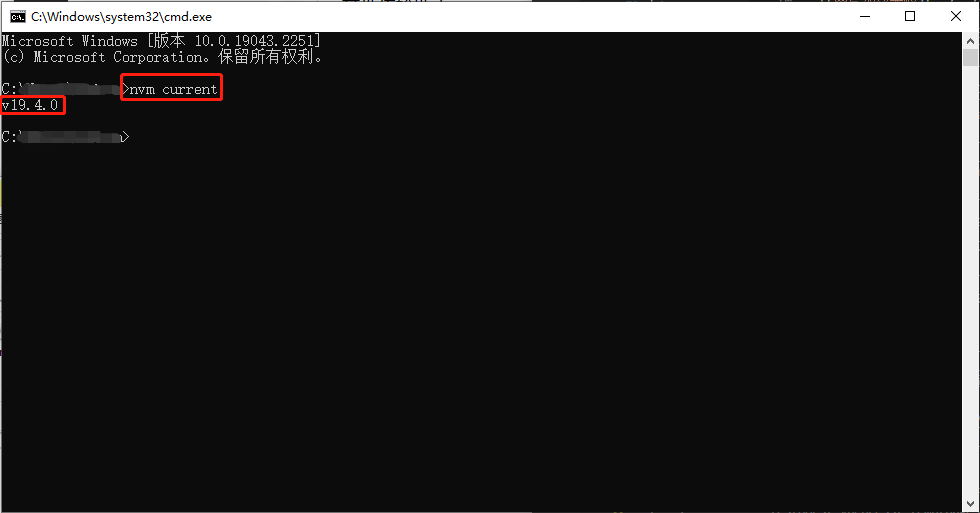
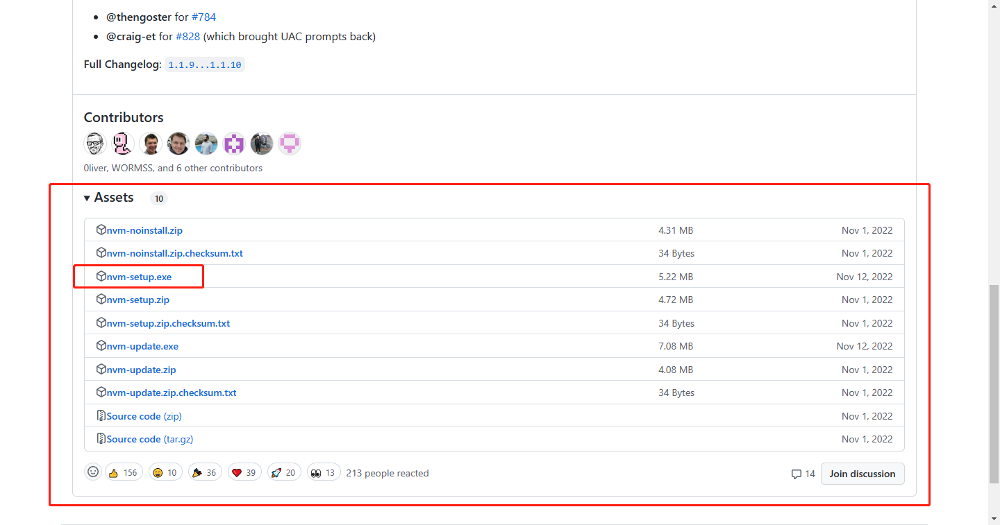

# nvm
## 简介
nvm全英文：node.js version management,是一个node.js的版本管理工具。由于工作中接触到的项目node.js各个版本会存在不兼容的情况。（例如：node.js 16与node-sass 4.14就会冲突）因此可以通过nvm安装和切换不同的node.js。

解决上诉问题方案：

1. 在[npm](https://www.npmjs.com/package/node-sass)中查看node版本与node-sass兼容版本。

2. 按住win+R按钮输入cmd回车，打开命令行工具。

3. 输入`nvm list`查看已有node版本。

4. 根据npm官网查询到的大概兼容版本,在**命令行界面**输入`nvm list available`查找到详细下载版本。

5. 下载对应的node版本`nvm install 19.4.0`

6. 利用nvm下载对应版本后，再次利用`nvm list`查看已有版本，此时已经可以发现新的版本出现了。

7. 退出命令行工具，用管理员身份启动命令行工具输入`nvm use 对应的版本号`，切换到兼容的node环境。

8. 输入`nvm current`查看现在使用的版本

## 查看nvm
可以在[github](https://github.com/nvm-sh/nvm/blob/master/README.md#installing-and-updating)上查看nvm源码。
## Windows下载nvm

>**选择其中一种方式就可以了。**

- 通过curl工具下载nvm。
```bash
curl -o- https://raw.githubusercontent.com/nvm-sh/nvm/v0.39.3/install.sh | bash
```
- 通过wget工具下载nvm。
```bash
wget -qO- https://raw.githubusercontent.com/nvm-sh/nvm/v0.39.3/install.sh | bash
```
- 通过exe安装nvm,下载[nvm-1.1.10-windows](https://github.com/coreybutler/nvm-windows/releases/tag/1.1.10)地址。


## nvm命令提示
- `nvm arch`：显示node是运行在32位还是64位。
- `nvm install <version> [arch]` ：安装node， version是特定版本也可以是最新稳定版本latest。可选参数arch指定安装32位还是64位版本，默认是系统位数。可以添加--insecure绕过远程服务器的SSL。
- `nvm list [available]` ：显示已安装的列表。可选参数available，显示可安装的所有版本。list可简化为ls。
- `nvm on` ：开启node.js版本管理。
- `nvm off` ：关闭node.js版本管理。
- `nvm proxy [url]` ：设置下载代理。不加可选参数url，显示当前代理。将url设置为none则移除代理。
- `nvm node_mirror [url]` ：设置node镜像。默认是https://nodejs.org/dist/。如果不写url，则使用默认url。设置后可至安装目录settings.txt文件查看，也可直接在该文件操作。
- `nvm npm_mirror [url]` ：设置npm镜像。https://github.com/npm/cli/archive/。如果不写url，则使用默认url。设置后可至安装目录settings.txt文件查看，也可直接在该文件操作。
- `nvm uninstall <version>` ：卸载指定版本node。
- `nvm use [version] [arch]` ：使用制定版本node。可指定32/64位。
- `nvm root [path]` ：设置存储不同版本node的目录。如果未设置，默认使用当前目录。
- `nvm version` ：显示nvm版本。version可简化为v。